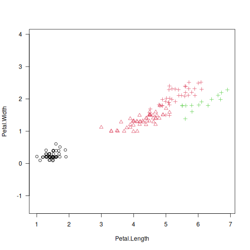
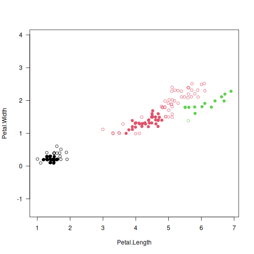

# lumbermark: Lumbermark: Fast and Robust Clustering

## Description

Lumbermark is a fast and robust divisive clustering algorithm which identifies a specified number of clusters.

It iteratively chops off sizeable limbs that are joined by protruding segments of a dataset\'s mutual reachability minimum spanning tree.

The use of a mutual reachability distance ($M>1$; Campello et al., 2013) pulls peripheral points farther away from each other. This way, Lumbermark gives an alternative to the HDBSCAN\* algorithm that is able to detect a predefined number of clusters and indicate outliers (via <span class="pkg">deadwood</span>; see Gagolewski, 2026).

## Usage

``` r
lumbermark(d, ...)

## Default S3 method:
lumbermark(
  d,
  k,
  min_cluster_size = 10,
  min_cluster_factor = 0.25,
  skip_leaves = (M > 0L),
  M = 5L,
  distance = c("euclidean", "l2", "manhattan", "cityblock", "l1", "cosine"),
  verbose = FALSE,
  ...
)

## S3 method for class 'dist'
lumbermark(
  d,
  k,
  min_cluster_size = 10,
  min_cluster_factor = 0.25,
  skip_leaves = (M > 0L),
  M = 5L,
  verbose = FALSE,
  ...
)

## S3 method for class 'mst'
lumbermark(
  d,
  k,
  min_cluster_size = 10,
  min_cluster_factor = 0.25,
  skip_leaves = TRUE,
  verbose = FALSE,
  ...
)
```

## Arguments

|  |  |
|----|----|
| `d` | a numeric matrix (or an object coercible to one, e.g., a data frame with numeric-like columns) or an object of class `dist` (see [`dist`](https://stat.ethz.ch/R-manual/R-devel/library/stats/help/dist.html)), or an object of class `mst` (see [`mst`](https://deadwood.gagolewski.com/rapi/mst.html)) |
| `...` | further arguments passed to [`mst()`](https://deadwood.gagolewski.com/rapi/mst.html) |
| `k` | integer; the desired number of clusters to detect |
| `min_cluster_size` | integer; minimal cluster size |
| `min_cluster_factor` | numeric value in (0,1); output cluster sizes will not be smaller than `min_cluster_factor*n/k` |
| `skip_leaves` | logical; whether the MST leaves should be omitted from cluster size counting |
| `M` | integer; smoothing factor; $M \leq 1$ gives the selected `distance`; otherwise, the mutual reachability distance is used |
| `distance` | metric used to compute the linkage, one of: `"euclidean"` (synonym: `"l2"`), `"manhattan"` (a.k.a. `"l1"` and `"cityblock"`), `"cosine"` |
| `verbose` | logical; whether to print diagnostic messages and progress information |

## Details

As with all distance-based methods (this includes k-means and DBSCAN as well), applying data preprocessing and feature engineering techniques (e.g., feature scaling, feature selection, dimensionality reduction) might lead to more meaningful results.

If `d` is a numeric matrix or an object of class `dist`, [`mst()`](https://deadwood.gagolewski.com/rapi/mst.html) will be called to compute an MST, which generally takes at most $O(n^2)$ time. However, by default, a faster algorithm based on K-d trees is selected automatically for low-dimensional Euclidean spaces; see [`mst_euclid`](https://quitefastmst.gagolewski.com/rapi/mst_euclid.html) from the <span class="pkg">quitefastmst</span> package.

Once a minimum spanning tree is determined, the Lumbermark algorithm runs in $O(kn)$ time. If you want to test different parameters or $k$s, it is best to compute the MST explicitly beforehand.

## Value

`lumbermark()` returns an object of class `mstclust`, which defines a $k$-partition, i.e., a vector whose $i$-th element denotes the $i$-th input point\'s cluster label between 1 and $k$.

The `mst` attribute gives the computed minimum spanning tree which can be reused in further calls to the functions from <span class="pkg">genieclust</span>, <span class="pkg">lumbermark</span>, and <span class="pkg">deadwood</span>.

The `cut_edges` attribute gives the $k-1$ indexes of the MST edges whose omission leads to the requested $k$-partition (connected components of the resulting spanning forest).

## Author(s)

[Marek Gagolewski](https://www.gagolewski.com/)

## References

M. Gagolewski, lumbermark, in preparation, 2026

R.J.G.B. Campello, D. Moulavi, J. Sander, Density-based clustering based on hierarchical density estimates, *Lecture Notes in Computer Science* 7819, 2013, 160-172, [doi:10.1007/978-3-642-37456-2_14](https://doi.org/10.1007/978-3-642-37456-2_14)

M. Gagolewski, A. Cena, M. Bartoszuk, Ł. Brzozowski, Clustering with minimum spanning trees: How good can it be?, *Journal of Classification* 42, 2025, 90-112, [doi:10.1007/s00357-024-09483-1](https://doi.org/10.1007/s00357-024-09483-1)

M. Gagolewski, deadwood, in preparation, 2026

M. Gagolewski, quitefastmst, in preparation, 2026

## See Also

The official online manual of <span class="pkg">lumbermark</span> at <https://lumbermark.gagolewski.com/>

[`mst()`](https://deadwood.gagolewski.com/rapi/mst.html) for the minimum spanning tree routines

## Examples


``` r
library("datasets")
data("iris")
X <- jitter(as.matrix(iris[3:4]))
y_pred <- lumbermark(X, k=3)
y_test <- as.integer(iris[,5])
plot(X, col=y_pred, pch=y_test, asp=1, las=1)
```



``` r
# detect 3 clusters and find outliers with Deadwood
library("deadwood")
y_pred2 <- lumbermark(X, k=3)
plot(X, col=y_pred2, asp=1, las=1)
is_outlier <- deadwood(y_pred2)
points(X[!is_outlier, ], col=y_pred2[!is_outlier], pch=16)
```


